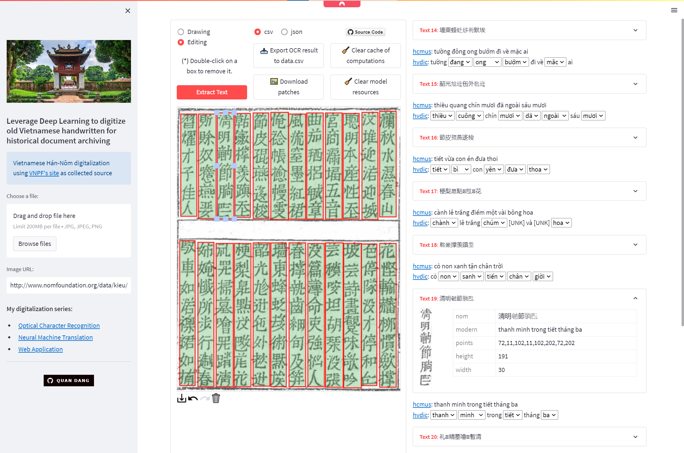

# Web application for Sino-Nôm digitalization

[](https://youtu.be/o5xpfwalEWw)

> Demo: https://share.streamlit.io/ds4v/nomnasite/main/app.py

## Usage

```bash
pip install requirements.txt
streamlit run app.py
```

👉 Check out [YouTube demo](https://youtu.be/o5xpfwalEWw)

## Features

1. Input image from local or URL.
2. Leverage DL models to extract text from image:
    - Use [VNPF's site](https://www.nomfoundation.org) as collected source.
    - Apply models based on the results of [NomNaOCR](https://github.com/ds4v/NomNaOCR).
3. Interactive mode using [streamlit-drawable-canvas](https://github.com/andfanilo/streamlit-drawable-canvas):
    - **Drawing** mode: draw rectangle boxes on image regions containing characters.
    - **Editing** mode: rotate, skew, scale, move any box of the canvas on demand.
    - Undo, Redo or Delete canvas contents.
4. Saving OCR results:
    - Export detection, recognition, and translation results to [CSV](data/data.csv) or [JSON](data/data.json).
    - Download [patches](data/patches.zip) cropped from detected bounding boxes.
5. Translate using APIs from:
    - VNUHCM University of Science: https://www.clc.hcmus.edu.vn/?page_id=3039
    - Sino-Nôm dictionary: https://hvdic.thivien.net/transcript.php#trans

**(\*)** Note: In **Editing** mode, double-click a box to remove it.

## Reference

My Vietnamese Sino-Nôm digitalization series :

-   [NomNaOCR](https://github.com/ds4v/NomNaOCR): Optical Character Recognition.
-   [NomNaNMT](https://github.com/ds4v/NomNaNMT): Neural Machine Translation.
-   [NomNaSite](https://github.com/ds4v/NomNaSite): Web Application.
